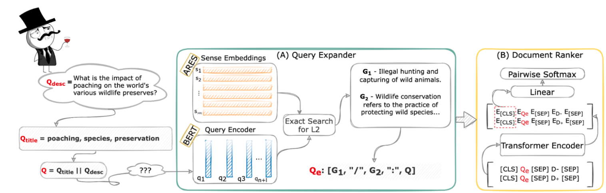

<div align="center">    

# IR like a SIR:<u>S</u>ense-enhanced <u>I</u>nformation <u>R</u>etrieval for Multiple Languages

[](https://aclanthology.org/2021.emnlp-main.79/)
[](https://2021.emnlp.org/)
[](https://creativecommons.org/licenses/by-nc/4.0/)

</div>

SIR (Sense-enhanced Information Retrieval) brings Word Sense Disambiguation (WSD) and Information Retrieval closer and provides additional semantic information for the query via sense definitions. This semantic information leads to improvements over a baseline that does not access semantics in multiple languages.



If you find our paper, code or framework useful, please reference this work in your paper:

```
@inproceedings{blloshmi-etal-2021-ir,
  title     = {IR like a SIR: Sense-enhanced Information Retrieval for Multiple Languages},
  author    = {Blloshmi, Rexhina and Pasini, Tommaso and Campolungo, Niccolò, Banerjee, Somnath and Navigli, Roberto and Pasi, Gabriella},
  booktitle = {Proceedings of the 2021 Conference on Empirical Methods in Natural Language Processing {EMNLP-2021}},
  publisher = {Association for Computational Linguistics},
  year      = {2021},
}
```

## 1. Setup 

I. Create a conda environment with **Python 3.6** and **PyTorch 1.7.1** and install the dependencies [requirements.txt](requirements.txt).

Via conda:

    conda create -n sir python=3.6
    conda activate sir
    pip install -r requirements.txt

To enable wandb logging: 

    wandb login

II. Download all the artifacts:

Download ARES embeddings indeces and replace the empty `ares` directory inside `data/`

**Anonymized Link:** [ARES Indeces](https://osf.io/am37y/?view_only=86f58551cb0a4413b11a512775c91cb2)

Download pretrained checkpoints and place them inside `out/`

**Anonymized Link:** [Checkpoints](https://osf.io/3qwxj/?view_only=b3af0286d2044147aa3d8854cc27909f)


## 2. SIR Training & Evaluation

### I. English monolingual retrieval in TREC Robust04* data:
    
Train on Robust04 folds:

    bash scripts/run_robust_sense_aware.sh 

Evaluate on Robust04 folds:
    
    bash scripts/rerank_robust_sense_aware.sh 

    
*These scripts contain the paths to fold1 of the Robust04 data. To run for other folds as well, please replace **f1** in _train_pairs_, _valid_run_ and _model_out_dir_ paths with the corresponding fold. Choices --> {f1, f2, f3, f4, f5}

### II. Non-English monolingual retrieval in CLEF 2000-2003* data:

Train in Robust04 merged folds: 

    bash scripts/run_robust_sense_aware_mult.sh

Evaluate in CLEF: 

    bash scripts/rerank_robust_sense_aware_mult.sh

## 3. VanillaBERT Training & Evaluation

### I. English monolingual retrieval in TREC Robust04* data:
    
Train on Robust04 folds:

    bash scripts/run_robust.sh 

Evaluate on Robust04 folds:
    
    bash scripts/rerank_robust.sh 

    
*These scripts contain the paths to fold1 of the Robust04 data. To run for other folds as well, please replace **f1** in _train_pairs_, _valid_run_ and _model_out_dir_ paths with the corresponding fold. Choices --> {f1, f2, f3, f4, f5}

### II. Non-English monolingual retrieval in CLEF 2000-2003* data:

Train in Robust04 merged folds: 

    bash scripts/run_robust_mult.sh

Evaluate in CLEF: 

    bash scripts/rerank_robust_mult.sh


*Due to proprietary nature of CLEF data, we do not provide the data for testing the models in this setting. We provide all the preprocessing steps starting from the original corpora in ``src/dataset_creation``.


## License
This project is released under the CC-BY-NC-SA 4.0 license (see `LICENSE`). If you use `SIR`, please put a link to this repo.

## Acknowledgements
The authors gratefully acknowledge the support of the [ERC Consolidator Grant MOUSSE](http://mousse-project.org) No. 726487 and the [ELEXIS project](https://elex.is/) No. 731015 under the European Union’s Horizon 2020 research and innovation programme.

* This work was supported by the PerLIR project (Personal Linguistic resources in Information Retrieval) funded by the MIUR Progetti di ricerca di Rilevante Interesse Nazionale programme (PRIN 2017).

* This work was supported in part by the MIUR under the grant "Dipartimenti di eccellenza 2018-2022" of the Department of Computer Science of the Sapienza University of Rome.

We adopted modules or code snippets from the open-source projects:
* [CEDR](https://github.com/Georgetown-IR-Lab/cedr) 